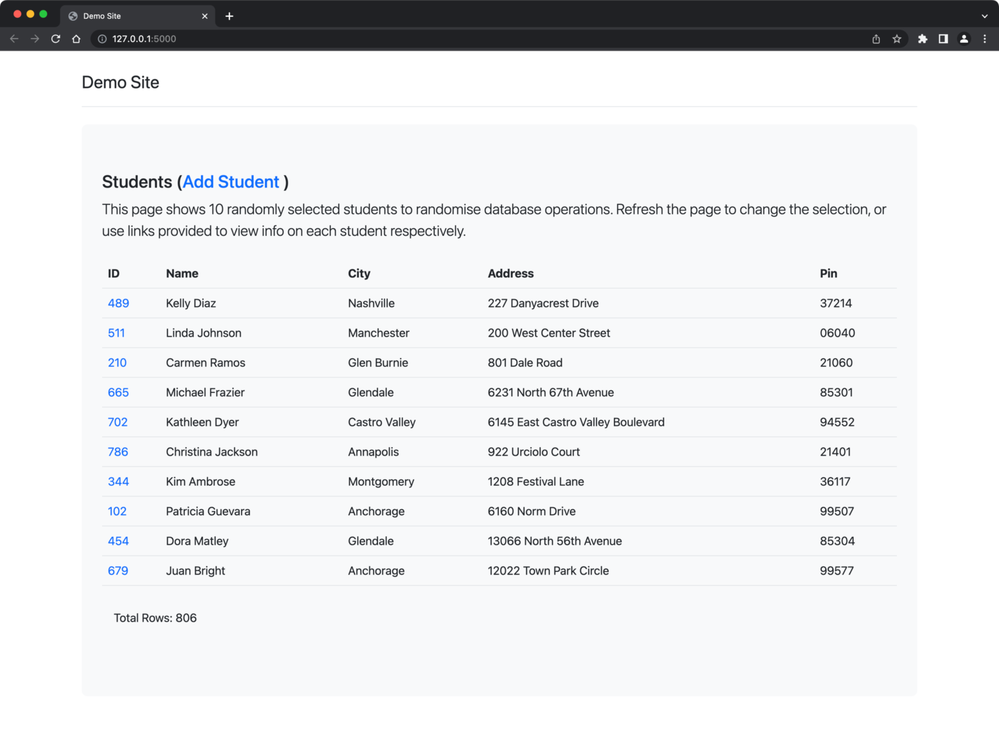

# Python Demo App



## Setup

1. Create the `.env` file using the Makefile.

   ```bash
   $ make .env
   ```

2. Start the DB container using the `sql_server.sh` script.
   
   ```
   $ ./sql_server.sh
   ```

3. Check that the database was created successfully.

   ```bash
   $ docker logs mariadb 2>&1 | grep "Entrypoint"
   ```

4. Connect to the database as root.

   ```bash
   $ source .env
   $ mysql --user=root --password=$MARIADB_ROOT_PASSWORD --host=localhost --port=3306 --protocol=tcp
   ```

   Modify the `demoapp-user` user so that they can login from anywhere.

   ```bash
   mysql> UPDATE mysql.user SET Host='%' WHERE Host='localhost' AND User='demoapp-user';
   mysql> UPDATE mysql.db SET Host='%' WHERE Host='localhost' AND User='demoapp-user';
   mysql> FLUSH PRIVILEGES;
   ```

   Disconnect from the database.

   > Install the mysql client if you don't have it already using brew: `brew install mysql-client`

5. Run the app.

   ```bash
   $ pipenv run app
   ```

   Leave the terminal running in the background.

6. Start another terminal and seed the database with user data

   ```bash
   $ pipenv run generate_data
   ```

7. Open the webpage in the browser: http://localhost:5000/

8. (optional) Use the `modify_data.py` script to send continuous random updates to the database to simulate load.

   ```bash
   $ pipenv run modify_data
   ```
